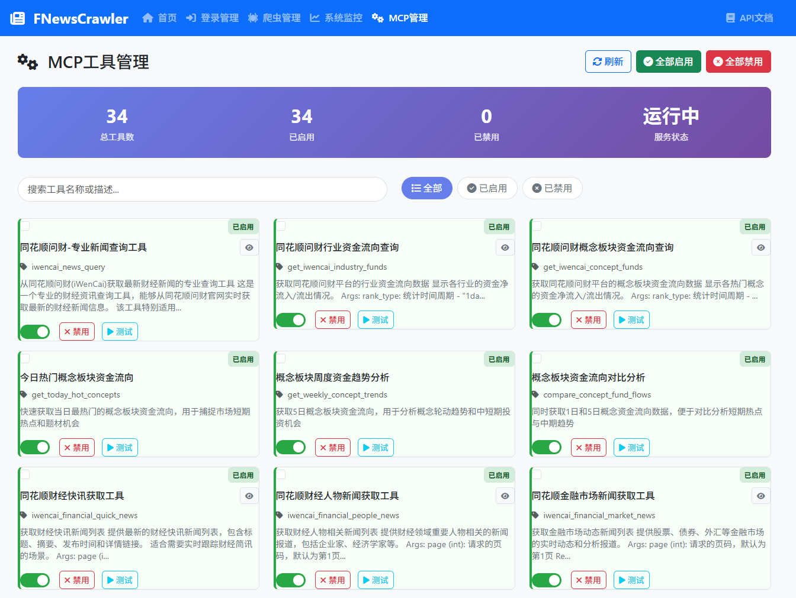

# FNewsCrawler

[](https://www.python.org/downloads/)
[](https://fastapi.tiangolo.com/)
[](https://modelcontextprotocol.io/)
[](LICENSE)

**专业的财经信息MCP服务** - 为大模型提供实时、准确的财经资讯数据

## 🚀 项目简介

FNewsCrawler 是一个专门为大模型设计的财经信息MCP（Model Context Protocol）服务，通过高效的爬虫技术从各大财经网站获取实时资讯，为AI模型提供准确、及时的财经数据支持。

### 🎯 核心特性

- **🤖 MCP协议兼容**：完全兼容Model Context Protocol，可无缝集成到各种AI应用中
- **📈 实时财经数据**：支持从同花顺问财等主流财经平台获取最新资讯
- **🏗️ 企业级架构**：采用单例模式的浏览器管理和上下文共享机制
- **🔐 智能登录系统**：支持二维码登录，自动维护登录状态
- **⚡ 高性能并发**：基于异步架构，支持高并发访问
- **🛡️ 生产级稳定性**：完善的错误处理、自动重试和健康检查机制
- **📊 可视化管理**：提供Web界面进行工具管理和系统监控



## 🏛️ 系统架构

```
FNewsCrawler
├── 🧠 MCP服务层          # 为大模型提供标准化接口
├── 🕷️ 爬虫引擎层         # 多站点财经数据采集
├── 🌐 浏览器管理层       # 单例浏览器实例管理
├── 🔄 上下文共享层       # 域名级别的会话状态管理
├── 🔐 登录认证层         # 二维码登录和状态维护
└── 💾 数据存储层         # Redis缓存和状态持久化
```

## 📦 快速开始

### 环境要求

- Python 3.12+
- Redis 服务器
- Chrome/Chromium 浏览器

### 安装部署

#### 🐳 Docker部署（推荐）

**方式一：从项目源码部署**
```bash
# 克隆项目
git clone https://github.com/noimank/FNewsCrawler.git
cd FNewsCrawler

# 构建并启动服务
docker-compose up -d

# 查看服务状态
docker-compose ps

# 查看日志
docker-compose logs -f

```

**方式二：快速部署启动**
```bash

#从dockerhub中拉取镜像并后台启动
docker run --name fnewscrawler -p 8480:8480 -d noimankdocker/fnewscrawler:latest
# 查看日志
docker logs fnewscrawler -f


```


> 📚 **详细文档**：查看 [Docker部署指南](docker/README.md) 了解完整的部署选项、配置说明和故障排除方法。

#### 📦 本地开发测试

1. **克隆项目**
```bash
git clone https://github.com/noimank/FNewsCrawler.git
cd FNewsCrawler


```

2. **安装依赖**
```bash
uv sync
uv run playwright install chromium
```

3. **配置环境**
```bash
# 创建 .env 文件，配置环境变量，建议关闭无头模式进行
cp .env.example .env

```

4. **启动Redis服务**
```bash
# Ubuntu/Debian
sudo systemctl start redis-server

# macOS
brew services start redis

# Windows
# 下载并启动Redis服务
```

5. **启动服务**
```bash
# 启动Web服务
uv run python main.py


```

### MCP客户端集成

MCP访问协议支持sse和http，通过环境变量MCP_SERVER_TYPE修改

mcp服务地址：http://localhost:8480/mcp/mcp-server

cherryStudio配置：
```
{
  "mcpServers": {
    "fnewscrawler": {
      "url": "http://localhost:8480/mcp/mcp-server",
      "type": "streamableHttp"
    }
  }
}
```

### get方法调用


调用端点：http://localhost:8480/api/mcp/call_tool/{tool_name}?xxxx

参数：
- tool_name：工具名称
- xxxx：工具参数

返回：
- 工具执行结果，json格式

示例：
```
GET http://localhost:8480/api/mcp/call_tool/get_industry_stock_funds_flow_tool?industry_name=银行
```

如果参数类型为list，需要用逗号分隔

示例：
```
GET http://localhost:8480/api/mcp/call_tool/news_crawl_batch?urls=http://example.com,http://example2.com
```

额外支持的功能：调用任意的akshare函数

调用端点：http://localhost:8480/api/mcp/call_akshare/{fun_name}?xxxx

参数：
- fun_name：函数名称
- xxxx：函数参数

支持对返回结果进行处理：
- duplicate_key：去重字段
- drop_columns：删除字段，多个字段用逗号分隔
- return_type：返回类型，markdown或json，默认markdown
- filter_condition：筛选条件字符串，类似于sql语法，采用pandas的query语句实现，参考：https://gairuo.com/p/pandas-query
- limit：返回数据条数限制，默认不限制
- sort_by：排序字段，指定按哪一列进行排序
- ascending：排序方式，true为升序，false为降序，默认true

返回：
- 函数执行结果，json格式，结果格式如下：

```json

{
  "success": true,
  "message": "调用工具 stock_zh_a_gbjg_em 成功",
  "data": {
    "result": xxxxx函数执行结果，markdown格式就是字符串，json格式就是list[str]xxxx
  }
}
```

示例：
```
GET http://localhost:8480/api/mcp/call_akshare/stock_zh_a_gbjg_em?symbol=603392.SH&return_type=json
GET http://localhost:8480/api/mcp/call_akshare/stock_zh_a_gbjg_em?duplicate_key=变更日期&drop_columns=流通受限股份,变动原因&return_type=json&symbol=603392.SH
GET http://localhost:8480/api/mcp/call_akshare/news_trade_notify_dividend_baidu?return_type=json&date=20240409&filter_condition=交易所 == "SZ"

# 排序和限制示例
GET http://localhost:8480/api/mcp/call_akshare/stock_zh_a_hist?symbol=000001&sort_by=日期&ascending=true&limit=10
GET http://localhost:8480/api/mcp/call_akshare/stock_zh_a_hist?symbol=000001&sort_by=收盘&ascending=false&limit=5&return_type=json
GET http://localhost:8480/api/mcp/call_akshare/stock_zh_a_hist?symbol=000001&filter_condition=收盘 > 10&sort_by=成交量&ascending=false&limit=3&drop_columns=变动因素
```


错误示例：
```
GET http://localhost:8480/api/mcp/call_akshare/stock_zh_a_gbjg_em?symbol="603392.SH"&return_type=json
```

**注意事项：**
- 不要给参数加上引号，单引号双引号都不要加，filter_condition除外
- sort_by字段必须是返回数据中的实际列名
- limit必须是正整数，ascending支持true/false、1/0、yes/no等格式

> 📚 **详细文档**：查看 [GET API 接口文档](docs/get_api.md) 了解完整的接口说明、参数配置和使用示例。


## 🛠️ 功能开发路线图

### 🔄 已完成
- [x] 同花顺问财新闻资讯查询接口
- [x] MCP协议标准支持
- [x] 同花顺行业资金流向查询接口
- [x] 同花顺概念资金流向查询接口
- [x] 通用新闻查询接口
- [x] 同花顺财经要闻、宏观经济、产经新闻、国际财经、金融市场、公司新闻、区域经济、财经评论、财经人物查询接口
- [x] 同花顺问财A股股票语义筛选工具
- [x] 同花顺问财融资融券信息查询工具
- [x] 同花顺问财历史资金流向查询工具
- [x] 东方财富某行业历史资金流查询工具
- [x] 东方财富某行业个股历史资金流查询工具
- [x] 东方财富大盘资金流查询工具
- [x] 东方财富股票大宗交易每日明细查询工具
- [x] 东方财富股票龙虎榜查询工具
- [x] tushare数据源支持
- [x] 股票技术指标查询接口
  - 移动平均线
  - 布林带
  - KDJ
  - MACD
  - RSI
  - VWMA
  - ATR
- [x] 股票筹码及胜率查询接口(tushare)
- [x] 股票筹码分布查询接口(akshare)
- [x] 接入akshare数据源
- [x] 提供get端点调用任意akshare函数
- [x] 北向/南向资金流向

### 📈 即将推出
- [ ] 龙虎榜数据接口
  - 机构交易明细
  - 营业部排名分析
- [ ] 行情中心接口
  - 实时行情推送
  - 盘口数据分析

tips：

大部分接口如果没有做成mcp接口的话，可以通过get方法调用akshare函数实现。

### 🎯 长期规划
- [ ] 扩展更多财经数据源
- [ ] 提供完整的API文档
- [ ] 高级数据分析工具

目标是构建一个全方位的财经信息MCP服务，为大模型提供实时、准确的财经资讯数据。


## 🔧 开发指南

### 添加新的财经数据源

1. **创建爬虫模块**
```bash
mkdir fnewscrawler/spiders/新站点名
touch fnewscrawler/spiders/新站点名/__init__.py
touch fnewscrawler/spiders/新站点名/crawl.py
touch fnewscrawler/spiders/新站点名/login.py  # 如需登录
```

2. **实现登录类**（如需要）
```python
from fnewscrawler.core.qr_login_base import QRLoginBase

class NewSiteLogin(QRLoginBase):
    async def get_qr_code(self, qr_type: str) -> Tuple[bool, str]:
        # 实现二维码获取逻辑
        pass
    
    async def verify_login_success(self) -> bool:
        # 实现登录验证逻辑
        pass
```

3. **创建MCP工具**
```python
# fnewscrawler/mcp/新站点名/crawl.py
from fnewscrawler.mcp import mcp_server

@mcp_server.tool()
async def new_site_query(query: str):
    """新站点查询工具描述"""
    # 实现查询逻辑
    pass
```

4. **注册工具**
```python
# fnewscrawler/mcp/新站点名/__init__.py
import fnewscrawler.mcp.新站点名.crawl
```

### 核心设计原则

- **单例模式**：BrowserManager和ContextManager采用单例模式，确保资源高效利用
- **域名隔离**：每个域名维护独立的浏览器上下文，避免会话冲突
- **异步优先**：全面采用异步编程，提升并发性能
- **状态持久化**：登录状态和会话信息自动保存到Redis
- **健康检查**：定期检查浏览器和上下文健康状态，自动恢复异常

## 📊 系统监控

访问 `http://localhost:8480/monitor` 查看系统状态：

- 🌐 **浏览器状态**：实例健康度、版本信息、资源使用
- 🔄 **上下文管理**：活跃会话、空闲时间、使用统计
- 🛠️ **MCP工具**：工具状态、启用/禁用管理
- 📈 **系统日志**：实时日志查看和过滤

## 🔧 工具管理

访问 `http://localhost:8480/mcp` 进行工具管理：

- ✅ **启用/禁用工具**：动态控制工具可用性
- 📝 **工具详情查看**：查看工具描述和参数
- 🔄 **批量操作**：支持批量启用/禁用工具
- 📊 **使用统计**：工具调用次数和状态监控

## 🤝 贡献指南

我们欢迎社区贡献！请查看 [开发文档](docs/) 了解详细信息：

- [爬虫开发指南](docs/spider_development.md)
- [MCP工具开发指南](docs/mcp_tool_development.md)

## 📄 许可证

本项目采用 MIT 许可证 - 查看 [LICENSE](LICENSE) 文件了解详情。

## 🙏 致谢

- [FastMCP](https://github.com/jlowin/fastmcp) - MCP协议实现
- [Playwright](https://playwright.dev/) - 浏览器自动化
- [FastAPI](https://fastapi.tiangolo.com/) - Web框架
- [Redis](https://redis.io/) - 数据存储

---

**为大模型提供专业的财经数据支持** 🚀

如有问题或建议，请提交 [Issue](https://github.com/noimank/FNewsCrawler/issues) 或 [Pull Request](https://github.com/noimank/FNewsCrawler/pulls)。